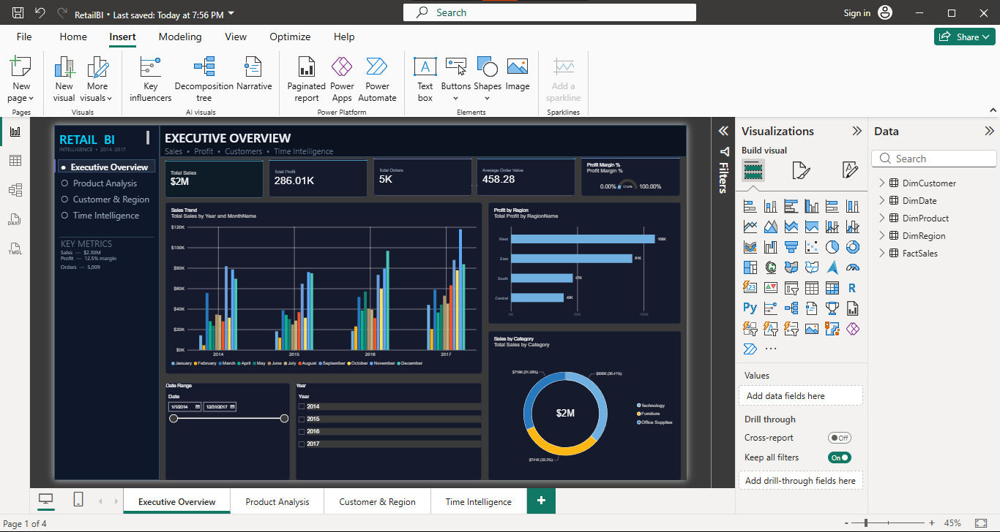
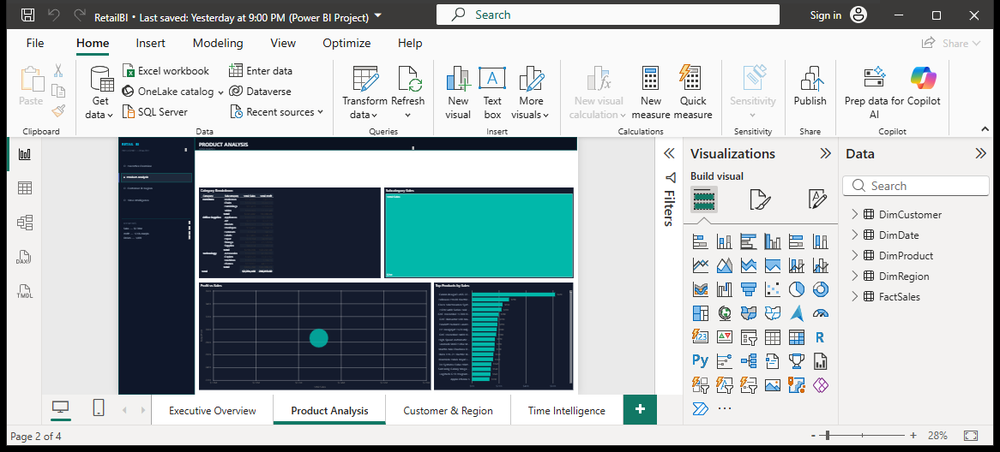
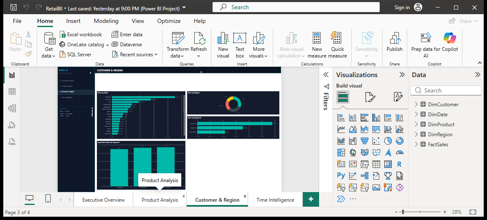
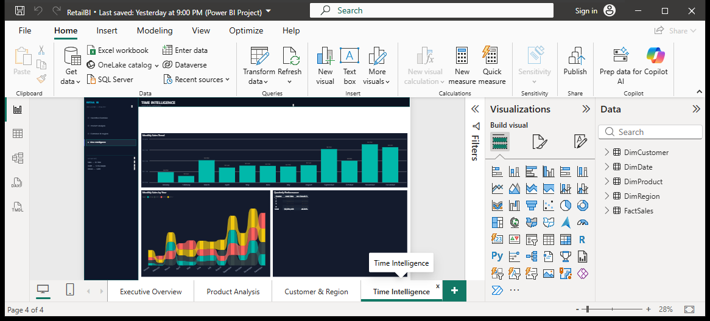

# Retail BI — Dark SaaS Analytics Dashboard

> **End-to-end Power BI project** — Sample Superstore → star schema → 7 DAX measures → 4-page dark premium dashboard (PBIP/PBIX) — fully screenshot-verified.

[](https://powerbi.microsoft.com)
[](powerbi/RetailBI.pbip)
[]()
[]()

**Live preview — dark SaaS build (actual screenshots, 28% zoom):**

| Executive Overview | Product Analysis |
|:---:|:---:|
|  |  |
| 5 KPIs + gauge · Sales Trend · Profit by Region · Sales by Category | Category Matrix · Subcategory Bars · Scatter · Top Products |

| Customer & Region | Time Intelligence |
|:---:|:---:|
|  |  |
| State / Region / Segment · AOV | Monthly Trend · Ribbon by Year · Quarterly Matrix |

*Screenshots archived in [`docs/screenshots/`](docs/screenshots/) — 8 PNGs (light + final dark). No mockups.*

---

## 📦 What’s inside

```
retail-bi-project/
├── data/           # star schema CSVs (FactSales 9,986 + 4 dims, DimDate 1,461 continuous)
├── dax/measures.md # 7 DAX KPIs
├── powerbi/
│   ├── RetailBI.pbip               # ← open this
│   ├── RetailBI.Report/            # PBIR definition (94 visuals, validated)
│   └── RetailBI.SemanticModel/     # TMDL star schema
├── docs/
│   ├── MANUAL_BUILD_GUIDE.md
│   ├── dashboard_mockup.md
│   └── screenshots/   # proof
└── README.md
```

## 🧱 Stack

| Layer | Tech |
|---|---|
| Source | Sample Superstore (9,994 rows, 2014–2017) |
| Prep | Power Query (`M`) + `process_data.py` (dedupe, typing, ProfitMargin) |
| Model | Star schema, `DimDate[Date]` marked as date table |
| Logic | DAX measures (not calculated columns) |
| Visual | Power BI Desktop 2.157 · PBIR 2.12 · Fluent2 dark theme `#0B1020 / #141B2D` |
| Charts | `cardVisual`, `barChart`, `columnChart`, `donutChart`, `treemap`, `scatterChart`, `ribbonChart`, `gauge`, `matrix`, `slicer`, `shape` + `textbox` chrome |

## 🗃️ Star Schema

```
          DimDate
             |
DimCustomer — FactSales — DimProduct
             |
          DimRegion
```
Single-direction 1:*; `FactSales.OrderDate → DimDate.Date` (continuous 2014-01-01→2017-12-31)

**FactSales:** OrderID, OrderDate, ShipDate, CustomerID, ProductID, RegionID, Sales, Quantity, Discount, Profit, ProfitMargin
**Dims:** CustomerKey/Name/Segment/Country/City/State/PostalCode · ProductKey/Category/Subcategory/Name · RegionID/Name · DateKey/Date/Year/Month/MonthName/Quarter

## 📐 DAX — 7 measures (`dax/measures.md`)

```DAX
Total Sales = SUM(FactSales[Sales])                    // $#,0
Total Profit = SUM(FactSales[Profit])                  // $#,0
Total Orders = DISTINCTCOUNT(FactSales[OrderID])       // 0
Average Order Value = DIVIDE([Total Sales],[Total Orders]) // $#,0.00
Profit Margin % = DIVIDE([Total Profit],[Total Sales]) // 0.00%
YoY Sales = CALCULATE([Total Sales], SAMEPERIODLASTYEAR(DimDate[Date])) // $#,0
YoY Growth % = DIVIDE([Total Sales]-[YoY Sales],[YoY Sales])             // 0.00%
```
`MonthName` sorted by `Month` for correct calendar order.

## 📊 Pages

1. **Executive Overview** — KPIs `Total Sales / Profit / Orders / AOV / Margin %` (gauge), Sales Trend (Year→MonthName hierarchy, column/area), Profit by Region (bar), Sales by Category (donut)
2. **Product Analysis** — Category/Subcategory matrix, Subcategory bars, Profit vs Sales scatter (Size = Sum Quantity), Top Products bar
3. **Customer & Region** — State bars, Region donut, Segment bars, AOV columns
4. **Time Intelligence** — Monthly Trend (MonthName), Monthly Sales by Year (ribbon, Series=Year), Quarterly Performance matrix (YoY Growth %)

Design: 320px `#0F172A` sidebar (RETAIL BI + 4-page nav + KEY METRICS), `#0B1020` canvas, `#141B2D` cards (`16px` radius, `#242E44` border, soft shadow), white / muted text, cyan `#22D3EE` / violet `#A78BFA` accents, `16px` gaps — screenshot-verified.

## 🚀 Run

```bat
:: 1. Double-click
powerbi\RetailBI.pbip
:: 2. Optional single-file
:: File → Save As → RetailBI.pbix
```

No refresh needed — CSVs at `F:\BI\retail-bi-project\data\*.csv` (portable `M` uses that path; re-point if you move the folder: Transform Data → Data source settings).

## ✅ Validation done headlessly

- 94 `visual.json` vs Microsoft PBIR schemas: **0 errors**
- Every `queryRef` exists in TMDL: **0 missing**
- 4 pages screenshot-audited via `PrintWindow` (all render dark, no blanks)

## 📄 Docs

- `docs/MANUAL_BUILD_GUIDE.md` — 15-min rebuild from CSVs
- `docs/dashboard_mockup.md` — ASCII layout blueprint
- `docs/BUILD_COMPLETE.md` — deliverable checklist

## 🔗 Deploy

Publish for a live URL: Desktop → **File → Publish → Publish to Power BI** → workspace → in Service **Share → Copy link** (Pro needed for public `Publish to web`). This GitHub repo + screenshots is already a portfolio-ready live preview.

## 📝 License

Sample Superstore is public. Code/docs MIT.
